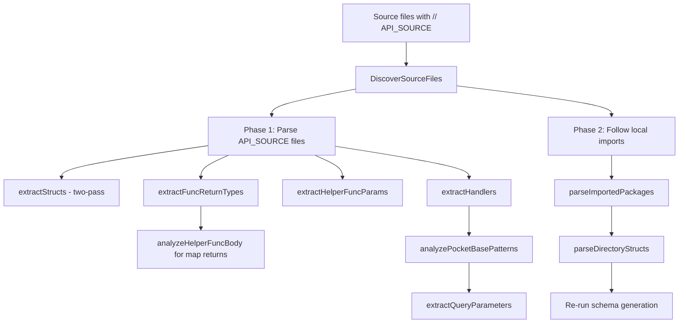

# AST Parsing System

The AST (Abstract Syntax Tree) parsing system is the core of pb-ext's automatic OpenAPI documentation generation. It analyzes your Go source code at startup to extract handler metadata, request/response schemas, and parameters without requiring manual annotations.

## Overview

The AST parser uses Go's `go/ast` and `go/parser` packages to analyze source files marked with the `// API_SOURCE` directive. It extracts:

- Handler function signatures and return types
- Request body types (from `BindBody` and `json.Decode`)
- Response schemas (from `c.JSON()` calls)
- Query, header, and path parameters
- Authentication requirements
- Struct definitions for component schemas

## File Structure

The AST parser is split across multiple files by responsibility:

| File | Purpose |
|------|--------|
| `ast.go` | Entry points: `NewASTParser`, `DiscoverSourceFiles`, `ParseFile`, `EnhanceEndpoint` |
| `ast_func.go` | Handler and function analysis: extracting handlers, return types, parameters |
| `ast_struct.go` | Struct analysis and schema generation |
| `ast_metadata.go` | Value and type resolution: map literals, expressions, type aliases |
| `ast_file.go` | File-level utilities: module path resolution, import following |

## Handler Detection

A function is recognized as a PocketBase handler if it matches this exact signature:

```go
func handlerName(c *core.RequestEvent) error
```go

The parser validates:
- Exactly one parameter of type `*core.RequestEvent`
- Returns `error` (not just any error-compatible type)

### What Gets Analyzed

For each detected handler, the parser tracks:

**Variables**: `map[string]string` — variable name → inferred Go type
```go
var todos []Todo // tracked as "todos" -> "[]Todo"
```

**VariableExprs**: `map[string]ast.Expr` — variable name → RHS AST node for deep analysis
```go
result := map[string]any{"count": 10} // stores the full map literal AST
```

**MapAdditions**: `map[string][]MapKeyAdd` — dynamic `mapVar["key"] = value` assignments
```go
response["timestamp"] = time.Now() // captured after the initial literal
```

## Two-Pass Struct Extraction

Struct extraction uses a **two-pass approach** to handle cross-references correctly:

**Pass 1**: Register all structs with fields (no schemas) and type aliases
```go
type UserResponse struct {
    User    User      // references User struct
    Profile Profile   // references Profile struct
}
```

**Pass 2**: Generate `JSONSchema` for each struct now that all names are known
- Resolves `$ref` pointers to other structs
- Flattens embedded struct fields
- Handles pointer fields with `nullable: true`

<Warning>
  Changing to single-pass will break nested struct `$ref` resolution. Do not modify this behavior.
</Warning>

## Request Detection

The parser detects request bodies from these patterns:

```go
// Pattern 1: BindBody
var req CreateTodoRequest
if err := c.BindBody(&req); err != nil {
    return err
}

// Pattern 2: json.Decode
var req UpdateTodoRequest
json.NewDecoder(c.Request.Body).Decode(&req)
```

The type is resolved from the variable's tracked type in `handlerInfo.Variables`.

## Response Detection

Response schemas are extracted from `c.JSON(status, expr)` calls:

```go
c.JSON(200, map[string]any{
    "todos": todos,
    "total": len(todos),
})
```

Analysis steps:
1. Try composite literal analysis (map/struct/slice)
2. If argument is a variable, trace to its stored expression
3. Merge any `MapAdditions` for that variable
4. Fall back to type inference → `$ref` for known structs
5. Last resort: generic object schema

## Parameter Detection

The parser detects parameters in **two passes**:

### Pass 1: Direct Body Scan

| Pattern | Source |
|---------|--------|
| `q := e.Request.URL.Query(); q.Get("param")` | query |
| `e.Request.URL.Query().Get("param")` | query |
| `e.Request.URL.Query()["param"]` | query |
| `info.Query["param"]` (via `e.RequestInfo()`) | query |
| `e.Request.Header.Get("name")` | header |
| `info.Headers["name"]` (via `e.RequestInfo()`) | header |
| `e.Request.PathValue("id")` | path (Required: true) |

### Pass 2: Indirect Helper Scan

The parser automatically detects parameters read by helper functions:

**Domain helpers** — literal param names:
```go
func parseTimeParams(e *core.RequestEvent) timeParams {
    q := e.Request.URL.Query()
    return timeParams{
        Interval: q.Get("interval"), // detected
        From:     q.Get("from"),     // detected
    }
}
```

**Generic helpers** — param name from call site:
```go
func parseIntParam(e *core.RequestEvent, name string, def int) int {
    return e.Request.URL.Query().Get(name) // sentinel stored
}

// In handler:
page := parseIntParam(e, "page", 1) // "page" extracted from 2nd arg
```

## Function Return Type Resolution

`extractFuncReturnTypes()` runs **before** handler analysis to enable type inference:

```go
func formatCandlesFull(records []Record) []map[string]any {
    // ... implementation
}

// Later in handler:
candles := formatCandlesFull(records)
c.JSON(200, candles) // type resolved to []map[string]any
```

Stored in `ASTParser.funcReturnTypes` as `map[string]string` (func name → Go type).

## Helper Function Body Analysis

For functions returning `map[string]any` or `[]map[string]any`, the parser **deep-analyzes** the function body:

```go
func buildSummary(r Record) map[string]any {
    summary := map[string]any{
        "price": r.GetFloat("price"),
        "volume": r.GetInt("volume"),
    }
    summary["timestamp"] = time.Now() // dynamic addition merged
    return summary
}
```

**How it works**:
1. Creates temporary `ASTHandlerInfo` to track variables
2. Finds all `map[string]any{...}` literals
3. Picks the literal with most keys (primary response shape)
4. Finds variable name via `findAssignedVariable()`
5. Merges dynamic `mapVar["key"] = value` additions
6. For `[]map[string]any`, wraps item schema in array

Results stored in `funcBodySchemas` for reuse during response analysis.

## Append-Based Slice Resolution

When handlers build slices via `append()`, the parser connects the item expression:

```go
results := make([]map[string]any, 0)
for _, r := range records {
    item := map[string]any{
        "id":    r.GetString("id"),
        "name":  r.GetString("name"),
    }
    results = append(results, item) // item expression stored
}
c.JSON(200, results) // array schema enriched with item properties
```

**How it works**:
1. `trackVariableAssignment()` detects `varName = append(varName, itemExpr)`
2. Stores `itemExpr` in `SliceAppendExprs[varName]`
3. `enrichArraySchemaFromAppend()` resolves item schema from stored expression

## Auto-Import Following

After parsing all `// API_SOURCE` files, the parser **automatically resolves local imports** to find struct definitions:

```go
package handlers

import "myapp/models" // local import

func createUser(c *core.RequestEvent) error {
    var req models.CreateUserRequest // struct from imported package
    c.BindBody(&req)
    // ...
}
```

**Process**:
1. Reads `go.mod` for module path (e.g., `github.com/user/myapp`)
2. Collects imports from all `// API_SOURCE` files
3. Strips module prefix → local directory path
4. Skips already-parsed directories
5. Calls `parseDirectoryStructs()` to extract structs only (no handlers)

<Note>
  Zero-config — no directives needed on type files. External imports are ignored.
</Note>

## Source File Directives

| Directive | Where | Purpose |
|-----------|-------|--------|
| `// API_SOURCE` | Top of .go file | Marks file for AST parsing |
| `// API_DESC <text>` | Function doc comment | Handler description in OpenAPI |
| `// API_TAGS <csv>` | Function doc comment | Comma-separated endpoint tags |

**Example**:
```go
// API_SOURCE
package handlers

// API_DESC Get all todos for the authenticated user
// API_TAGS todos, user
func getTodosHandler(c *core.RequestEvent) error {
    // ...
}
```

## Debug Endpoint

Inspect the full AST parser state at runtime:

```bash
GET http://127.0.0.1:8090/api/docs/debug/ast
```

Returns:
- All parsed structs and their schemas
- All detected handlers and their metadata
- Per-version endpoints
- Component schemas
- Complete OpenAPI output

<Warning>
  Requires authentication. Use superuser credentials.
</Warning>

## Common Patterns

### Anonymous Struct Request Body

```go
var body struct {
    Name  string `json:"name"`
    Email string `json:"email"`
}
c.BindBody(&body)
```

The parser generates inline schema from the anonymous struct definition.

### Index Expression Resolution

When a helper reads from another helper's return:

```go
summary := buildSummary(record)
price := summary["price"] // resolves to float64 from funcBodySchemas
```

### Variable Tracing

```go
result := map[string]any{"count": 10}
result["items"] = items // merged via MapAdditions
c.JSON(200, result)      // both keys appear in schema
```

## Parser Lifecycle



## Performance

AST parsing happens **once at startup**. Specs are cached in memory. For production builds, use pre-generated specs from disk (see [Spec Generation](/advanced/spec-generation)).

## Further Reading

- [Spec Generation](/advanced/spec-generation) - Build-time spec generation
- [Middleware](/advanced/middleware) - Custom middleware patterns
- [Reserved Routes](/advanced/reserved-routes) - Protected pb-ext routes
