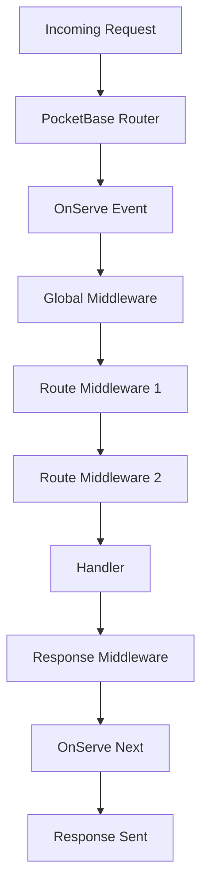

# Middleware

Middleware in pb-ext allows you to intercept and modify requests/responses, enforce authentication, log requests, and implement cross-cutting concerns.

## Middleware Patterns

pb-ext supports PocketBase's middleware system with two binding methods:

### .Bind() - Hook Middleware

Binds a middleware that implements `hook.Handler[T]`:

```go
router.POST("/api/v1/todos", createTodoHandler).Bind(apis.RequireAuth())
```

**Characteristics**:
- Returns `hook.Handler[T]` (wraps the event)
- Can short-circuit the chain by not calling `e.Next()`
- Type-safe with generics

### .BindFunc() - Function Middleware

Binds a plain function:

```go
router.GET("/api/v1/todos", getTodosHandler).BindFunc(func(e *core.ServeEvent) error {
    // Middleware logic
    return e.Next() // Continue chain
})
```

**Characteristics**:
- Simpler syntax
- No hook.Handler wrapper needed
- Can access `e.Router`, `e.App`, `e.Server`

## PocketBase Built-in Middleware

PocketBase provides several authentication middleware:

### RequireAuth

Requires any authenticated user (user or admin):

```go
router.POST("/api/v1/todos", createTodoHandler).Bind(apis.RequireAuth())
```

### RequireAdminAuth

Requires admin/superuser authentication:

```go
router.DELETE("/api/v1/admin/users/{id}", deleteUserHandler).Bind(apis.RequireAdminAuth())
```

### RequireRecordAuth

Requires authenticated record from a specific collection:

```go
router.GET("/api/v1/profile", getProfileHandler).Bind(
    apis.RequireRecordAuth("users"),
)
```

### RequireAdminOrRecordAuth

Requires either admin or record auth:

```go
router.GET("/api/v1/todos/{id}", getTodoHandler).Bind(
    apis.RequireAdminOrRecordAuth("users"),
)
```

## Chaining Middleware

Middleware can be chained using multiple `.Bind()` calls:

```go
router.POST("/api/v1/todos", createTodoHandler).
    Bind(rateLimitMiddleware()).
    Bind(apis.RequireAuth()).
    Bind(validateRequestMiddleware())
```

**Execution order**: Left-to-right (rate limit → auth → validate → handler)

## Custom Middleware Examples

### Request Logger Middleware

From `cmd/server/routes.go`:

```go
// requestLoggerMW logs the method, path, and latency of each request.
func requestLoggerMW(e *core.ServeEvent) error {
    start := time.Now()
    
    // Continue to handler
    err := e.Next()
    
    // Log after handler completes
    duration := time.Since(start)
    log.Printf("%s %s - %v", 
        e.Request.Method, 
        e.Request.URL.Path, 
        duration,
    )
    
    return err
}

// Usage:
router.GET("/api/v1/todos", getTodosHandler).BindFunc(requestLoggerMW)
```

**Key Points**:
- Calls `e.Next()` to continue chain
- Measures time before/after handler
- Returns the error from `e.Next()`

### Rate Limiting Middleware

```go
import "golang.org/x/time/rate"

var limiter = rate.NewLimiter(10, 20) // 10 req/sec, burst of 20

func rateLimitMiddleware() hook.Handler[*core.ServeEvent] {
    return func(e *core.ServeEvent) error {
        if !limiter.Allow() {
            return e.JSON(429, map[string]any{
                "error": "rate limit exceeded",
            })
        }
        return e.Next()
    }
}

// Usage:
router.POST("/api/v1/todos", createTodoHandler).
    Bind(rateLimitMiddleware()).
    Bind(apis.RequireAuth())
```

### Request ID Middleware

```go
import "github.com/google/uuid"

func requestIDMiddleware(e *core.ServeEvent) error {
    requestID := uuid.New().String()
    
    // Add to response headers
    e.Response.Header().Set("X-Request-ID", requestID)
    
    // Store in context for handler access
    e.Set("request_id", requestID)
    
    return e.Next()
}

// Access in handler:
func myHandler(c *core.RequestEvent) error {
    requestID := c.Get("request_id").(string)
    // ...
}
```

### CORS Middleware

```go
func corsMiddleware(e *core.ServeEvent) error {
    e.Response.Header().Set("Access-Control-Allow-Origin", "*")
    e.Response.Header().Set("Access-Control-Allow-Methods", "GET, POST, PATCH, DELETE")
    e.Response.Header().Set("Access-Control-Allow-Headers", "Content-Type, Authorization")
    
    // Handle preflight
    if e.Request.Method == "OPTIONS" {
        return e.NoContent(200)
    }
    
    return e.Next()
}
```

### Validation Middleware

```go
func validateContentType(contentType string) hook.Handler[*core.ServeEvent] {
    return func(e *core.ServeEvent) error {
        if e.Request.Header.Get("Content-Type") != contentType {
            return e.JSON(415, map[string]any{
                "error": "unsupported media type",
                "expected": contentType,
            })
        }
        return e.Next()
    }
}

// Usage:
router.POST("/api/v1/todos", createTodoHandler).
    Bind(validateContentType("application/json")).
    Bind(apis.RequireAuth())
```

### Error Recovery Middleware

```go
func recoveryMiddleware(e *core.ServeEvent) error {
    defer func() {
        if r := recover(); r != nil {
            e.App.Logger().Error("panic recovered", "error", r, "stack", string(debug.Stack()))
            e.JSON(500, map[string]any{
                "error": "internal server error",
            })
        }
    }()
    
    return e.Next()
}
```

## Request Event Flow

The complete request flow with middleware:



**Example with multiple middleware layers**:

```go
app.OnServe().BindFunc(func(e *core.ServeEvent) error {
    // Global middleware (all routes)
    e.Router.Use(corsMiddleware)
    
    // Register versioned routes
    v1 := router.SetPrefix("/api/v1")
    
    // Route-specific middleware
    v1.POST("/todos", createTodoHandler).
        BindFunc(requestLoggerMW).
        Bind(rateLimitMiddleware()).
        Bind(apis.RequireAuth()).
        Bind(validateContentType("application/json"))
    
    return e.Next()
})
```

**Execution order**:
1. `corsMiddleware` (global)
2. `requestLoggerMW` (route-specific)
3. `rateLimitMiddleware` (route-specific)
4. `apis.RequireAuth()` (route-specific)
5. `validateContentType` (route-specific)
6. `createTodoHandler` (handler)

## Middleware with VersionedAPIRouter

When using pb-ext's versioned router:

```go
func registerV1Routes(router *api.VersionedAPIRouter) {
    prefix := "/api/v1"
    
    // Middleware applies to all routes in this version
    router.Use(requestLoggerMW)
    
    // Per-route middleware
    router.GET(prefix+"/todos", getTodosHandler)
    router.POST(prefix+"/todos", createTodoHandler).
        Bind(apis.RequireAuth())
}
```

## Context Values

Store and retrieve values in the request context:

### Set Value in Middleware

```go
func authMiddleware(e *core.ServeEvent) error {
    user := authenticateUser(e.Request)
    e.Set("current_user", user)
    return e.Next()
}
```

### Get Value in Handler

```go
func myHandler(c *core.RequestEvent) error {
    user := c.Get("current_user").(*User)
    // Use user...
}
```

## Best Practices

<CardGroup cols={2}>
  <Card title="Call e.Next()" icon="arrow-right">
    Always call `e.Next()` to continue the middleware chain, unless intentionally short-circuiting.
  </Card>
  <Card title="Order Matters" icon="list-ol">
    Place authentication middleware before authorization. Place logging middleware early to capture all requests.
  </Card>
  <Card title="Return Errors" icon="triangle-exclamation">
    Always return errors from middleware. Don't silently swallow them.
  </Card>
  <Card title="Avoid Side Effects" icon="shield">
    Keep middleware focused. Avoid complex business logic in middleware.
  </Card>
</CardGroup>

## Common Patterns

### Conditional Middleware

Apply middleware only if a condition is met:

```go
func conditionalAuth(enabled bool) hook.Handler[*core.ServeEvent] {
    return func(e *core.ServeEvent) error {
        if enabled {
            return apis.RequireAuth()(e)
        }
        return e.Next()
    }
}

// Usage:
router.GET("/api/v1/todos", getTodosHandler).
    Bind(conditionalAuth(os.Getenv("REQUIRE_AUTH") == "true"))
```

### Middleware Factory

Create reusable middleware with configuration:

```go
func loggingMiddleware(logger *slog.Logger) func(*core.ServeEvent) error {
    return func(e *core.ServeEvent) error {
        start := time.Now()
        err := e.Next()
        logger.Info("request",
            "method", e.Request.Method,
            "path", e.Request.URL.Path,
            "duration", time.Since(start),
            "error", err,
        )
        return err
    }
}

// Usage:
router.GET("/api/v1/todos", getTodosHandler).
    BindFunc(loggingMiddleware(app.Logger()))
```

### Response Transformation

Modify responses after handler execution:

```go
func wrapResponseMiddleware(e *core.ServeEvent) error {
    // Capture response
    // Note: This requires custom response writer wrapper
    
    err := e.Next()
    
    // Transform response
    // e.Response.Body() modifications
    
    return err
}
```

## Performance Considerations

### Middleware Cost

Each middleware adds latency:
- **Auth check**: ~1-5ms (database lookup)
- **Rate limiting**: &lt;1ms (in-memory check)
- **Logging**: &lt;1ms (async preferred)
- **Validation**: ~1-10ms (depends on complexity)

### Optimization Tips

1. **Cache auth results** for repeated checks
2. **Use async logging** to avoid blocking
3. **Skip middleware** for health check endpoints
4. **Combine middleware** when possible

## Testing Middleware

```go
func TestRateLimitMiddleware(t *testing.T) {
    // Create mock event
    e := &core.ServeEvent{
        Request: httptest.NewRequest("GET", "/api/v1/todos", nil),
        Response: httptest.NewRecorder(),
    }
    
    // Create middleware
    mw := rateLimitMiddleware()
    
    // Test first request (should pass)
    err := mw(e)
    assert.NoError(t, err)
    
    // Test rate limit exceeded
    for i := 0; i < 100; i++ {
        mw(e)
    }
    err = mw(e)
    assert.Error(t, err)
}
```

## Further Reading

- [AST Parsing](/advanced/ast-parsing) - Handler detection patterns
- [Reserved Routes](/advanced/reserved-routes) - pb-ext route middleware
- [Reserved Collections](/advanced/reserved-collections) - System collections
