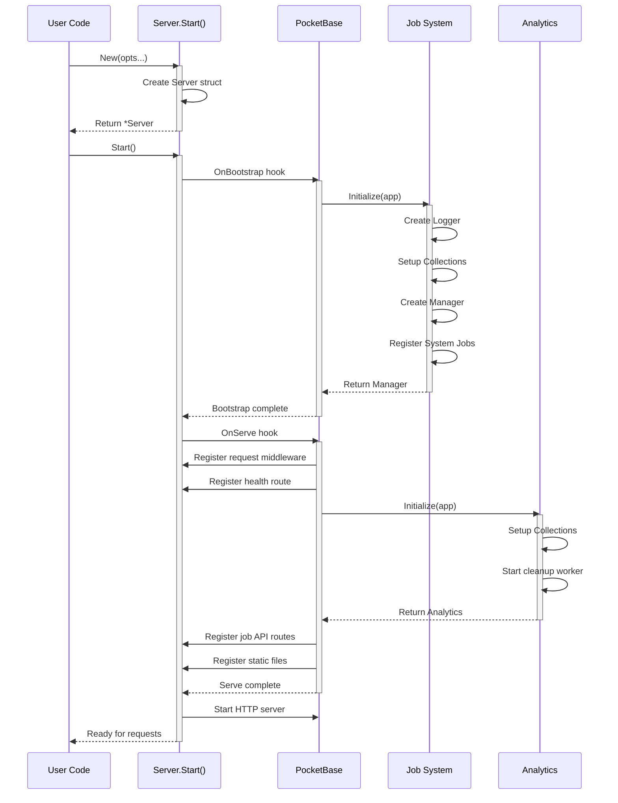

## Lifecycle Overview

The pb-ext server follows a predictable lifecycle with distinct phases:

<Steps>
  <Step title="Initialization">
    Create server with `New()` and apply options
  </Step>
  <Step title="Bootstrap Phase">
    Initialize infrastructure: JobLogger → JobManager → System Jobs
  </Step>
  <Step title="Serve Phase">
    Register routes, analytics, middleware, and static files
  </Step>
  <Step title="Runtime">
    Handle requests and execute scheduled jobs
  </Step>
</Steps>

## Phase 1: Initialization

The server is created using the `New()` constructor with functional options:

```go cmd/server/main.go
func initApp(devMode bool) {
    var opts []app.Option

    if devMode {
        opts = append(opts, app.InDeveloperMode())
    } else {
        opts = append(opts, app.InNormalMode())
    }

    srv := app.New(opts...)
    app.SetupLogging(srv)

    registerCollections(srv.App())
    registerRoutes(srv.App())
    registerJobs(srv.App())

    if err := srv.Start(); err != nil {
        log.Fatal(err)
    }
}
```

### Server Creation

The `New()` function creates a `Server` instance wrapping PocketBase:

```go core/server/server.go
func New(create_options ...Option) *Server {
    var (
        opts    *options = &options{}
        pb_conf *pocketbase.Config
        pb_app  *pocketbase.PocketBase
    )

    // Apply options
    for _, opt := range create_options {
        opt(opts)
    }

    // Create PocketBase config
    if opts.config != nil {
        pb_conf = opts.config
    } else {
        pb_conf = &pocketbase.Config{
            DefaultDev: opts.developer_mode,
        }
    }

    // Create PocketBase instance
    if opts.pocketbase != nil {
        pb_app = opts.pocketbase
    } else {
        pb_app = pocketbase.NewWithConfig(*pb_conf)
    }

    return &Server{
        app:     pb_app,
        options: opts,
        stats: &ServerStats{
            StartTime: time.Now(),
        },
    }
}
```

<Info>
At this point, no collections are created and no routes are registered. This happens in the bootstrap and serve phases.
</Info>

## Phase 2: Bootstrap

The bootstrap phase initializes core infrastructure **before** the HTTP server starts. This is triggered by PocketBase's `OnBootstrap()` hook.

### Job System Initialization

```go core/server/server.go
app.OnBootstrap().BindFunc(func(e *core.BootstrapEvent) error {
    app.Logger().Info("🌱 Server bootstrapping",
        "time", time.Now(),
        "pid", os.Getpid(),
    )

    if err := e.Next(); err != nil {
        return NewInternalError("bootstrap_initialization", 
            "Failed to initialize core resources", err)
    }

    // Initialize job management system
    jobManager, err := jobs.Initialize(app)
    if err != nil {
        app.Logger().Error("Failed to initialize job management system", 
            "error", err)
    } else {
        s.jobManager = jobManager

        if err := jobManager.RegisterInternalSystemJobs(); err != nil {
            app.Logger().Error("Failed to register internal system jobs", 
                "error", err)
        }

        s.jobHandlers = jobs.NewHandlers(jobManager)
        app.Logger().Info("✅ Job management system initialized")
    }

    app.Logger().Info("✨ Server bootstrap complete")
    return nil
})
```

### Job System Bootstrap Flow

The job system initializes in a specific order:

<Steps>
  <Step title="Create Job Logger">
    `jobs.Initialize()` creates a `Logger` that manages log persistence
  </Step>
  <Step title="Setup Collections">
    Creates the `_job_logs` PocketBase collection for execution logs
  </Step>
  <Step title="Create Job Manager">
    Instantiates the `Manager` that orchestrates cron jobs
  </Step>
  <Step title="Register System Jobs">
    Registers built-in cleanup jobs (`__pbExtLogClean__`, `__pbExtAnalyticsClean__`)
  </Step>
  <Step title="Create Job Handlers">
    Instantiates HTTP handlers for the job management API
  </Step>
</Steps>

```go core/jobs/manager.go
func Initialize(app core.App) (*Manager, error) {
    logger, err := InitializeLogger(app)
    if err != nil {
        return nil, err
    }
    m := NewManager(app, logger)

    // Set global singleton
    globalManager = m

    return m, nil
}
```

### System Jobs

pb-ext automatically registers two system jobs during bootstrap:

**Log Cleanup Job** (`__pbExtLogClean__`):
```go
m.RegisterJob(
    "__pbExtLogClean__",
    "__pbExtLogClean__",
    "Clean up pb-ext job logs older than 72 hours",
    "0 0 * * *",  // Daily at midnight
    func(el *ExecutionLogger) {
        el.Start("Log Cleanup Job")
        cutoff := time.Now().Add(-72 * time.Hour)
        // ... deletion logic ...
        el.Complete("Log cleanup finished")
    },
)
```

**Analytics Cleanup Job** (`__pbExtAnalyticsClean__`):
```go
m.RegisterJob(
    "__pbExtAnalyticsClean__",
    "__pbExtAnalyticsClean__",
    "Delete _analytics records older than 90 days",
    "0 3 * * *",  // Daily at 3 AM
    func(el *ExecutionLogger) {
        el.Start("Analytics Cleanup Job")
        cutoff := time.Now().AddDate(0, 0, -90)
        // ... deletion logic ...
        el.Complete("Analytics cleanup finished")
    },
)
```

<Warning>
Bootstrap runs **before** the HTTP server starts. Don't register routes or middleware here.
</Warning>

## Phase 3: Serve

The serve phase initializes HTTP components **after** the server starts. This is triggered by PocketBase's `OnServe()` hook.

### Request Tracking Middleware

The first `OnServe` hook registers global request tracking:

```go core/server/server.go
app.OnServe().BindFunc(func(e *core.ServeEvent) error {
    // Register request tracking middleware
    e.Router.BindFunc(func(c *core.RequestEvent) error {
        start := time.Now()
        s.stats.ActiveConnections.Add(1)

        if !shouldExcludeFromStats(c.Request.URL.Path) {
            s.stats.TotalRequests.Add(1)
        }

        err := c.Next()

        s.stats.ActiveConnections.Add(-1)
        s.stats.LastRequestTime.Store(time.Now().Unix())

        duration := time.Since(start).Nanoseconds()
        // Update average request time...

        return err
    })

    return e.Next()
})
```

### Route Registration

The serve phase registers all HTTP routes:

```go core/server/server.go
app.OnServe().BindFunc(func(e *core.ServeEvent) error {
    // Health dashboard route
    s.RegisterHealthRoute(e)

    // Analytics system
    analyticsInst, err := analytics.Initialize(app)
    if err != nil {
        app.Logger().Error("Failed to initialize analytics", "error", err)
    } else {
        s.analytics = analyticsInst
        analyticsInst.RegisterRoutes(e)
        app.Logger().Info("✅ Analytics system initialized")
    }

    // Job API routes
    if s.jobHandlers != nil {
        s.jobHandlers.RegisterRoutes(e)
        app.Logger().Info("⚡ Job API routes registered")
    }

    // Static file serving
    publicDirPath := "./pb_public"
    e.Router.GET("/{path...}", apis.Static(os.DirFS(publicDirPath), false))

    return e.Next()
})
```

### Analytics Initialization

The analytics system creates collections and starts background workers:

```go core/analytics/analytics.go
func Initialize(app core.App) (*Analytics, error) {
    app.Logger().Info("Initializing analytics system")

    if err := SetupCollections(app); err != nil {
        return nil, err
    }

    a := New(app)
    go a.sessionCleanupWorker()  // Background cleanup goroutine

    return a, nil
}
```

### Health Dashboard

The health dashboard at `/_/_` is registered during serve:

```go core/server/health.go
func (s *Server) RegisterHealthRoute(e *core.ServeEvent) {
    // Parse embedded templates
    tmpl, err := template.New("").Funcs(templateFuncs).ParseFS(TemplateFS, templateFiles...)
    if err != nil {
        log.Printf("Error parsing health templates: %v", err)
        return
    }

    healthHandler := func(c *core.RequestEvent) error {
        // Check authentication
        if c.Auth == nil || !c.Auth.IsSuperuser() {
            // Show login template
            return c.HTML(http.StatusOK, loginTemplate)
        }

        // Collect system stats and render dashboard
        data, err := s.prepareTemplateData()
        return c.HTML(http.StatusOK, renderTemplate(tmpl, data))
    }

    e.Router.GET("/_/_", healthHandler)
}
```

## Hook Binding Patterns

### Internal Hooks (Framework)

The framework binds hooks in the `Start()` method:

```go
func (s *Server) Start() error {
    app := s.app

    // Bootstrap hooks
    app.OnBootstrap().BindFunc(func(e *core.BootstrapEvent) error {
        // Infrastructure initialization
        return nil
    })

    // Serve hooks
    app.OnServe().BindFunc(func(e *core.ServeEvent) error {
        // Route registration
        return e.Next()
    })

    return app.Start()
}
```

### User Hooks (Application)

Users bind hooks **before** calling `Start()`:

```go cmd/server/main.go
srv := app.New(opts...)

// Register user collections
registerCollections(srv.App())

// Register user routes
registerRoutes(srv.App())

// Register user jobs
registerJobs(srv.App())

// User-defined serve hooks
srv.App().OnServe().BindFunc(func(e *core.ServeEvent) error {
    app.SetupRecovery(srv.App(), e)
    return e.Next()
})

// Start the server (triggers all hooks)
if err := srv.Start(); err != nil {
    log.Fatal(err)
}
```

### Hook Execution Order

<Steps>
  <Step title="User OnBootstrap Hooks">
    Registered before `Start()` via `srv.App().OnBootstrap().BindFunc()`
  </Step>
  <Step title="Framework OnBootstrap Hook">
    Registered in `Start()` - initializes jobs, logging, etc.
  </Step>
  <Step title="User OnServe Hooks">
    Registered before `Start()` via `srv.App().OnServe().BindFunc()`
  </Step>
  <Step title="Framework OnServe Hooks">
    Registered in `Start()` - registers routes, analytics, middleware
  </Step>
</Steps>

<Tip>
Always register user hooks **before** calling `srv.Start()`. The framework's internal hooks are registered during `Start()`.
</Tip>

## Accessing the Job Manager

The job manager is available as a global singleton after bootstrap:

```go
jobManager := server.GetJobManager()

jobManager.RegisterJob(
    "my-job",
    "My Custom Job",
    "Does something useful",
    "*/5 * * * *",  // Every 5 minutes
    func(el *jobs.ExecutionLogger) {
        el.Start("My Custom Job")
        // Job logic here
        el.Complete("Job finished successfully")
    },
)
```

## Lifecycle Diagram



## Next Steps

<CardGroup cols={2}>
  <Card title="Configuration" href="/core/configuration" icon="gear">
    Learn about server options and configuration patterns
  </Card>
  <Card title="Job Management" href="/features/cron-jobs" icon="clock">
    Explore cron job registration and execution
  </Card>
</CardGroup>